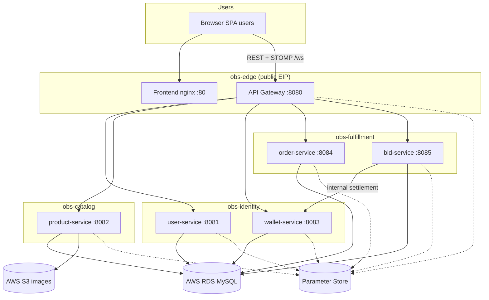
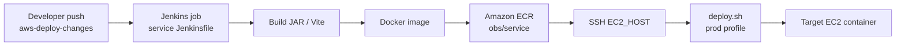
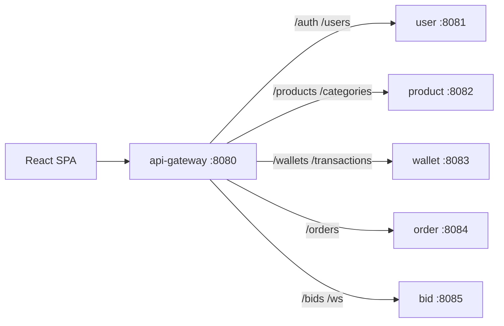

# Architecture — Online Bidding System

Brief outline of the system and the **AWS deploy work** on branch `aws-deploy-changes` (who / what / where / how / why).

---

## Who

| Role | Responsibility |
|------|----------------|
| **Browser users** | Admin, Seller, Buyer, Delivery Partner via the React SPA |
| **API gateway** | Single public API/WebSocket entry; JWT check; CORS; routes to services |
| **Microservices** | user, product, wallet, order, bid — each owns its domain + DB schema |
| **Jenkins** | Build, push image to ECR, SSH deploy to the right EC2 |
| **AWS** | EC2 hosts, ECR images, RDS MySQL, S3 images, Parameter Store secrets/URLs |
| **Team** | Ayush Sarbariya, Tejas Bayaskar, Pavitra Nedungadi (PG-DAC major project) |

---

## What

A **microservices auction platform**:

- SPA (React + Vite) talks only to the **gateway** (`:8080`) for REST and STOMP WebSocket (`/ws`)
- Gateway forwards to internal services (`:8081`–`:8085`)
- Prod: Docker on EC2, secrets from Parameter Store, shared RDS, S3 for product images
- Branch `aws-deploy-changes` added the **CI/CD + prod wiring** (Dockerfiles, Jenkinsfiles, `application-prod.yml`, deploy scripts) and follow-up fixes (CORS, IST auction clock, health delays)

---

## Where (runtime)

| Place | Runs |
|-------|------|
| **obs-edge** | Frontend (nginx `:80`) + api-gateway (`:8080`) — public EIP (demo `3.6.164.251`) |
| **obs-identity** | user-service (`:8081`) + wallet-service (`:8083`) |
| **obs-catalog** | product-service (`:8082`) |
| **obs-fulfillment** | order-service (`:8084`) + bid-service (`:8085`) |
| **RDS** | Shared MySQL instance; one schema per service |
| **ECR** | `obs/<service>` images |
| **Parameter Store** | `/obs/prod/` (shared) + `/obs/<service>/` (URLs, CORS, tokens) |
| **Local** | `start-backend.ps1` + Vite; config from root `.env` |

Cross-service URLs in prod use **private IPs**. Browsers only hit the **edge public** host.

---

## How (request & deploy paths)

### Runtime request path

1. Browser loads SPA from edge `:80`
2. SPA calls `VITE_API_BASE_URL` (gateway `:8080`) with JWT
3. Gateway validates JWT (except public routes), strips untrusted identity headers, routes by path
4. Target service uses JPA → its RDS schema; bids may call wallet internally; bids broadcast over STOMP

### Deploy path (`aws-deploy-changes`)

1. Push branch → Jenkins job (service `Jenkinsfile`)
2. `mvn` / `npm` build → Docker image → push **ECR**
3. SSH to `EC2_HOST` → `scripts/deploy.sh` pulls image, runs container with `SPRING_PROFILES_ACTIVE=prod`
4. App reads Parameter Store; health via `/actuator/health`

### Notable fixes on this branch

| What | Why |
|------|-----|
| Gateway CORS allows **PATCH** + exact `/products` routes | Admin product update preflight was blocked |
| User-service CORS from **SSM** (no circular `${}` self-ref) | Service failed to boot / rejected SPA origin |
| Bid + product Docker **`Asia/Kolkata`** | Auction windows were UTC vs India wall-clock |
| Optional user-service health **initial delay** | Cold start probes were too eager |

---

## Why

| Decision | Reason |
|----------|--------|
| API gateway in front of all services | One CORS/JWT edge; hide internal ports from the browser |
| Split services + schemas | Independent deploys and clearer ownership |
| 4 EC2 hosts (co-locate 2 containers where needed) | Stay within AWS vCPU quota while running full stack + frontend |
| Parameter Store instead of committed secrets | Prod credentials/URLs stay out of Git |
| Jenkins per service | Rebuild/redeploy only what changed |
| IST on bid/product JVMs | Auction start/end must match times sellers enter in India |

---

## Diagrams

### Runtime architecture

### CI/CD (Jenkins → ECR → EC2)

### Logical service map (local or prod)

---

## Related docs

- [`README.md`](README.md) — folder structure, how to run locally
- [`IMPLEMENTATION_NOTES.md`](IMPLEMENTATION_NOTES.md) — feature-level changes (realtime bids, admin CRUD, API client)
- [`frontend/README.md`](frontend/README.md) — frontend env and prod edge notes
